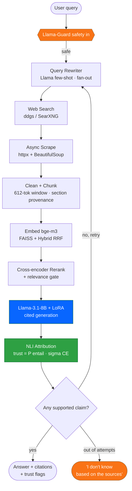
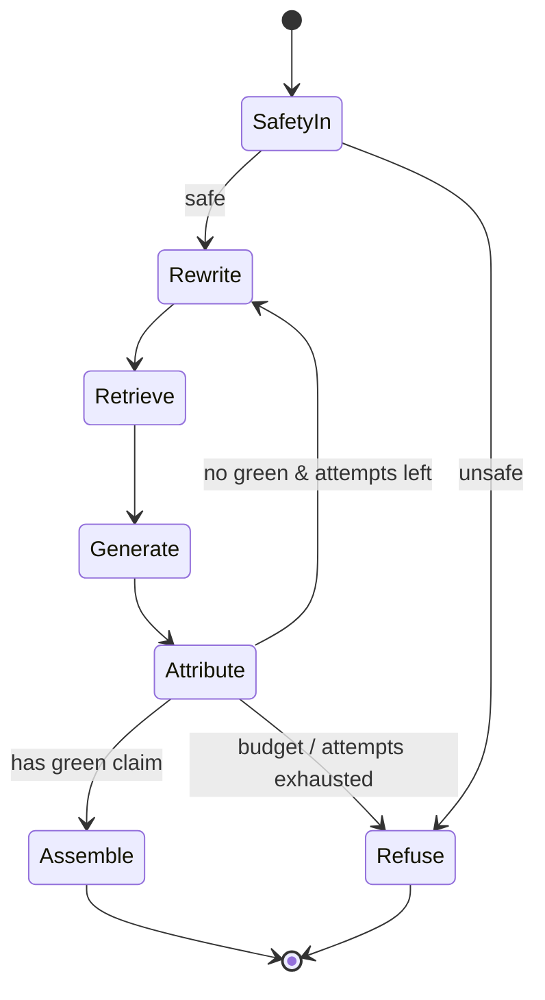

<div align="center">


<br/>

### XRAG simply means the generated answer in your RAG can be explained. I have created a citation method to cite every generated sentence so that naive users can understand from which source a fact is coming to avoid hallucinations.

I have built this project on open models & datasets such as Llma. A LoRA-tuned Llama-3.1-8B does the writing, LangGraph runs the retry loop, FAISS handles live web search and an NLI model decides whether each citation actually holds up i.e. calculating the faithfulness numerically.

<br/>

[](<DEMO_VIDEO_URL>)
&nbsp;
[](https://github.com/SKT799/XRAG-Explainable-RAG-Llama8B)

<br/>


</div>

---

## So what is this?

Plenty of RAG demos can answer a question. Far fewer can tell you whether they just made the answer up i.e. they lack explainability.

That gap is the whole reason I created X-RAG. Ask it something like *"who won the 2022 World Cup and who scored the most goals?"* and it won't just hand back a tidy paragraph. Every sentence gets checked, on its own, against the actual page it cites. The "Argentina won" claim comes back green with a trust score of 0.99 — source [8] (Wikipedia) genuinely backs it. The top-scorer line, cited to [7], flags red at 0.26 — the attribution model wasn't convinced that page actually supports it. You see both. No squinting at a wall of links trying to guess which half to trust.

And when it can't find anything solid? It rewrites the question, searches again, and takes another swing. Still nothing after a few tries — it just says *"I don't know based on the sources."* Which, honestly, is the one move most chatbots will not make.

The beauty of this project is: No OpenAI key needed. No Anthropic key needed. Nothing behind a paywall. Clone it, open the Colab notebook, run the cells top to bottom.

---

## What's actually in here

- A **Llama-3.1-8B generator** I fine-tuned with LoRA — SFT first, then DPO — so it cites sources inline instead of inventing a `[3]` out of nowhere. That training story is its own [write-up](https://github.com/SKT799/LoRA-FineTuning-Llama-3.1-8B).
- **Live web retrieval.** It searches, scrapes the pages concurrently, strips out the boilerplate (nav bars, footers, ad blocks) with link- and text-density heuristics, and chunks what's left into ~600-token windows that still remember which heading they came from (so a citation can point you to the right *section*, not just the right URL).
- **Hybrid search** — dense `bge-m3` vectors in FAISS fused with keyword hits via Reciprocal Rank Fusion. A cross-encoder re-sorts the shortlist after that, and a relevance floor tosses anything clearly off-topic *before* the LLM ever sees it.
- The agentic part: a **LangGraph** state machine that notices when an answer has zero supported claims and loops back to retry with a fresh query. Three attempts, on a clock.
- The explainability part: a **DeBERTa NLI** model that scores each citation and paints it green or red.
- A **three-way demo** — same question, three answers side by side: tuned model with retrieval, raw model with the same chunks, and the raw model with no sources at all. That last column is a good reminder of how confidently a bare LLM gets things wrong.

---

## The pipeline, end to end



---

## How the green and red flags work

This is the part I'm most pleased with, so bear with me for a second.

Two questions decide whether a citation earns your trust. One: does the cited page *actually say* the thing the model claims? That comes from the NLI model — entailment. Two: was that page even relevant to the question in the first place? That comes from the reranker. Multiply the two together:

```
trust = P(entailment) x sigma(reranker score)
```

The case that matters most is high relevance with low entailment. The page is on-topic, looks completely legitimate, and still doesn't support the sentence. That's textbook hallucination — and it's exactly the kind of miss a "here are your top sources" UI quietly papers over.

| Cited page says it? | Was it relevant? | Flag |
|:---:|:---:|:---|
| yes | yes | **green** — a citation you can lean on |
| yes | no | a coincidence, treat with caution |
| **no** | **yes** | **red** — relevant page, wrong claim (the dangerous one) |
| no | no | red — off in the weeds |

Anything under 0.75 goes red. One thing worth admitting up front: that NLI judge needed babysitting. Early on its calibration temperature ran off to about 7 and *everything* flagged red — tuned model, raw model, didn't matter. Clamping it to a sane `[0.5, 3.0]` range is what made the scores mean something again. (More on that in the [fine-tuning README](https://github.com/SKT799/LoRA-FineTuning-Llama-3.1-8B).)

---

## The retry loop (LangGraph)

A linear pipeline answers once and stops. This one doesn't.

When the first attempt comes back with no supported claim, the graph routes back to the rewriter, reformulates the question, and searches again — up to three times, watching a time budget so it never spins forever. If LangGraph isn't installed, or anything throws, it quietly drops down to a plain-Python version of the same flow. Same nodes, no drama.



---

## What it's built on

| Layer | Tooling |
|---|---|
| Generator | `NousResearch/Meta-Llama-3.1-8B-Instruct` + LoRA (PEFT), bf16 |
| Embeddings | `BAAI/bge-m3` into FAISS (dense + lexical, fused with RRF, `k=60`) |
| Reranker | `BAAI/bge-reranker-v2-m3` cross-encoder + relevance floor |
| Attribution | `MoritzLaurer/DeBERTa-v3-large-mnli-fever-anli-ling-wanli` |
| Safety | `meta-llama/Llama-Guard-3-8B`, with a regex fallback if it won't load |
| Orchestration | LangGraph state machine, async `httpx`, Redis cache |
| Serving / UI | FastAPI, Gradio, Pydantic v2 / pydantic-settings, YAML config |
| Training | TRL (SFT + DPO), PEFT, Transformers |

Every knob lives in one file — [`config/config.yaml`](colab_pipeline/config/config.yaml). Change behavior there, not in twelve places.

---

## Did the fine-tuning actually do anything?

Fair question to ask — half the "I fine-tuned an LLM" projects out there never bother to check.

So this one checks. It runs every held-out query twice: once through the raw base model, once through the tuned one, with identical retrieval and the same NLI judge both times. The adapter is the *only* thing that changes between the two runs.

| Metric | Raw base | Tuned (SFT + DPO) | Change |
|---|:---:|:---:|:---:|
| Citation precision | 0.075 | **0.142** | about 1.9x |
| Citation F1 | 0.070 | **0.162** | about 2.3x |

Roughly double the citation F1. I won't oversell it — the absolute numbers are small, the NLI judge is intentionally harsh, and this is a LoRA on an 8B, not some from-scratch frontier model. But the lift is real, and it shows up across the whole test split rather than riding on one lucky query. The unvarnished version is in the [fine-tuning README](https://github.com/SKT799/LoRA-FineTuning-Llama-3.1-8B).

---

## Getting it running (Colab)

```bash
# 1. Zip the colab_pipeline/ folder, upload to Colab, extract it
# 2. Drop your HuggingFace token into Colab Secrets as HF_TOKEN
# 3. Open the notebook and run top to bottom:
colab_pipeline/run_full_pipeline.ipynb
```

Just want the demo? Run sections `0, 1, 5` — that gets you cited answers and a public Gradio link, and it's fine on a free T4. Want the whole thing (build the data, train on an A100, run the raw-vs-tuned eval, then the demo)? Run `0` through `5` in order.

Locally, if you'd rather poke at the API and tests (install the dependencies from the notebook's setup cell first):

```bash
uvicorn app.api.main:app --reload        # FastAPI
python -m unittest discover -s tests     # 66 tests, pure stdlib
```

---

## Where things live

```
colab_pipeline/
├── run_full_pipeline.ipynb     <- the one notebook that runs it all
├── app/
│   ├── retrieval/              search · scrape · chunk · embed · rerank
│   ├── generation/             cited generation + citation de-stacking
│   ├── attribution/            DeBERTa-NLI trust scoring
│   ├── orchestrator/           engine + the LangGraph retry loop (graph.py)
│   ├── planning/               query rewriter / fan-out
│   ├── safety/  api/  storage/ Llama-Guard · FastAPI · Redis cache
│   └── schemas.py              Pydantic request/response models
├── training/                   SFT · DPO · rewriter · NLI-head trainers
├── eval/                       the raw-vs-tuned harness
├── ui/app_gradio.py            three-way comparison demo
├── config/config.yaml          one source of truth
└── tests/                      66 unit tests
```

---

> Curious about the model side of this? The [**LoRA fine-tuning write-up**](https://github.com/SKT799/LoRA-FineTuning-Llama-3.1-8B) goes deep on the SFT/DPO recipe and how the NLI judge keeps it honest.

<div align="center">

**If this was useful, a star goes a long way.**

</div>
